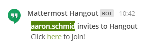

# Mattermost plugin for integrating hangouts

**The Concept is from [this](https://github.com/suda/slack-hangout) repository.**

## Introduction

This Application allows you to create a Hangout Call via a Command.



## Installation / Configuration

You can ether use docker or just nodejs. However we recomend using docker to install and use this application.
First of all you need to get your client id and client secret from google. How you do this is specified below.
To use this application you ether need a valid domain and a server connected to this domain. If you dont have something like that you can use [Heroku](http://www.heroku.com). 

### Get Client ID and Secret from google console

1. Go to Google Developers Console
2. Create Project
3. In `APIs & Services` select `Library` and enable `Google Calendar API`
4. In `OAuth consent screen` fill the required fields
5. In `APIs & Services` select `Credentials`, click `Create credentials` and select `Create OAuth client ID`
  * Set Application Type to Web application
  * Set Authorized JavaScript Origins to your hangout plugin url
  * Set Authorized Redirect URI to your Server URL with /oauth2callback suffix (i.e. http://mydomain.com:5000/oauth2callback)
  * Click `Create`
  * Copy your `Client ID` and `Client Secret`

### Docker

You can use docker-compose to run this application with docker.

1. Clone this repository (or you can take only docker file [from here](https://github.com/chitter99/mattermost-hangout-docker))
2. Add your info to docker-compose.yml
3. Run `docker-compose build mattermost-hangout`
4. Run `docker-compose up -d mattermost-hangout`
5. Follow Step 6 from the NodeJS Instructions.
 
### NodeJS

1. Install NodeJS and NPM, just follow the instructions provided [here](https://howtonode.org/how-to-install-nodejs). 
2. Download this repository or clone it with git:
```
git init
git clone https://github.com/chitter99/mattermost-hangout.git
```

3. Install dependencies. To install all dependencies you can use the following command. Ensure you are in the directory where you downloaded this repository and you have installed npm.
```
npm install
```
 * After that you need to install one additional package with the following command:
```
npm install dotenv
```

4. Create a file called ".env" (without the quotes) and enter the following.
```
CLIENT_ID=<your client id>
CLIENT_SECRET=<your client secret>
REDIRECT_URL=<http[s]://your-app-domain.xyz[:5000(optional port)]>/oauth2callback
HOSTNAME=<http[s]://your-app-domain.xyz[:5000(optional port)]>
PORT=5000 (app port, optional)
MM_VERIFY_TOKEN=xz7-mm-token (mm token which is given when you register a new slash command. it's optional - no check if not provided
AUTO_DELETE_EVENT="true"
MESSAGE='**{user} invites to Hangout "{summary}"**\nClick <{link}|here> to join!'' - optional (see below)
```
  * You now need to add your client id, client secret and redirect url from google. If you want to you can enter a new port (the port must be the same on your redirect url. So if you change him here, change him also in your google console). 
  * You will need to enter your external Ip Address, Domain or local Ip to enable support for a Bot icon. For example I'm running this Application on a Server in our Network, avariable under the local Ip Adress 192.168.1.10. I would enter this Ip Adress.
 
5. To run this application only the following command is required.
```
npm -r dotenv/config start
```
 * If you want to you can put this in a batch, shell or bash file depending on your platform.

6. Link with Google Account The last thing you will need to do is link your Application with an Google Account.
  * To do this open you Webbrowser and visit `http://<your-ip-or-domain>:5000/auth` and login with an Google Account.
  * I recomend creating an extra Google Account, because all meetings will be scheduled as this User.
  * When creating a new Google Account, open Google Calendar Settings and change `Automatically add video calls to events I create` to `true` on order to ensure this Application works. You can find this setting [here](https://calendar.google.com/calendar/render#settings-general_11).

## Integration into Mattermost

To Enable using this command:
- Go to your Mattermost instance 
- Select a Team and press on the three dots right to your username
- Choose Integrations then Slash Commands and add a new Command
- Add Title (for example `Hangouts`), Description, add Command Trigger Word (for example `hangout`)
- Add Request URL: `http://<your-ip-or-domain>:5000` 
- Set Request Method to POST 
- Test the Integration by entering /hangout into any channel or private group you want

## Customize Message

You can change the Message this Plugin sends to all users via your .env file or a parameter. The Variable `MESSAGE` is responsible for that. You can use the following values which will be replaced before sending the Message to Mattermost.

`{user}`: Will be replaced with the sender's Username.
`{link}`: Will be replaced with the link to the Mattermost Meeting.
`{summary}`: Will be replaced with the title of the event

An example is defined below.
```
**{user} invites you to "{summary}"**. <{link}|join> Hangout!
```
